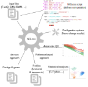

# NGLess: NGS Processing with Less Work

 Ngless is a domain-specific language for
NGS (next-generation sequencing data) processing.

For questions and discussions, please use the [ngless mailing
list](https://groups.google.com/forum/#!forum/ngless).

If you are using NGLess, please cite:

> _NG-meta-profiler: fast processing of metagenomes using NGLess, a
> domain-specific language_ by Luis Pedro Coelho, Renato Alves, Paulo Monteiro,
> Jaime Huerta-Cepas, Ana Teresa Freitas, Peer Bork, Microbiome (2019)
> [https://doi.org/10.1186/s40168-019-0684-8](https://doi.org/10.1186/s40168-019-0684-8)

## Example

    ngless "1.0"
    input = fastq(['ctrl1.fq','ctrl2.fq','stim1.fq','stim2.fq'])
    input = preprocess(input) using |read|:
        read = read[5:]
        read = substrim(read, min_quality=26)
        if len(read) < 31:
            discard

    mapped = map(input,
                    reference='hg19')
    write(count(mapped, features=['gene']),
            ofile='gene_counts.csv',
            format={csv})

## Installing

See the [install documentation](https://ngless.embl.de/install.html) for more
information.

### Bioconda

The recommended way to install NGLess is through
[bioconda](http://bioconda.github.io):

    conda install -c bioconda ngless 

### Docker

Alternatively, a docker container with NGLess is available at
[docker hub](https://hub.docker.com/r/nglesstoolkit/ngless):

    docker run -v $PWD:/workdir -w /workdir -it nglesstoolkit/ngless:1.0.0 ngless --version

Adapt the mount flags (``-v``) as needed.

### Linux

You can get a [statically linked version of
NGless
1.0.1](https://github.com/ngless-toolkit/ngless/releases/download/v1.0.1/NGLess-1.0.1-static-Linux64)
or a [nighly build of the latest development
code](https://gitlab.com/ngless/ngless/builds/artifacts/master/raw/bin/ngless?job=build-and-test-ubuntu).
This should work across a wide range of Linux versions (please
[report](https://github.com/ngless-toolkit/ngless/issues) any issues you encounter):

    curl -L -O https://github.com/ngless-toolkit/ngless/releases/download/v1.0.1/NGLess-1.0.1-static-Linux64
    chmod +x NGLess-1.0.1-static-Linux64
    ./NGLess-1.0.1-static-Linux64

This download bundles bwa, samtools and megahit (also statically linked).

If you want to try one of ngless' builtin modules (motus, specI, ...) you can
download [the full nighly build zip
file](https://gitlab.com/ngless/ngless/builds/artifacts/master/download?job=build-and-test-ubuntu)
which includes them.

### From Source

Installing/compiling from source is also possible. Clone
[https://github.com/ngless-toolkit/ngless](https://github.com/ngless-toolkit/ngless)

#### Dependencies

The simplest way to get an environment will all the dependencies is to use conda:

    conda create -n ngless
    source activate ngless
    conda config --add channels conda-forge
    conda install stack cairo bzip2 gmp zlib perl wget xz pkg-config make

You should have `gcc` installed (or another C-compiler).

The following sequence of commands should download and build the software

    git clone https://github.com/ngless-toolkit/ngless
    cd ngless
    make

To install, you can use the following command (replace `<PREFIX>` with
the directory where you wish to install, default is `/usr/local`):

    make install prefix=<PREFIX>

## More information

- [Full documentation](https://ngless.embl.de/)
- [Frequently Asked Questions (FAQ)](https://ngless.embl.de/faq.html)
- [ngless mailing list](https://groups.google.com/forum/#!forum/ngless)
- [What's new log](https://ngless.embl.de/whatsnew.html)

## Authors

- [Luis Pedro Coelho](http://luispedro.org) (email: [coelho@embl.de](mailto:coelho@embl.de)) (on twitter: [@luispedrocoelho](https://twitter.com/luispedrocoelho))
- Paulo Monteiro
-  Renato Alves
- [Ana Teresa Freitas](http://web.tecnico.ulisboa.pt/ana.freitas/)
-  Peer Bork

