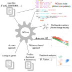

# NGLess: NGS Processing with Less Work

 Ngless is a domain-specific language for
NGS (next-generation sequencing data) processing.

For questions and discussions, please use the [NGLess mailing
list](https://groups.google.com/forum/#!forum/ngless).

If you are using NGLess, please cite:

> _NG-meta-profiler: fast processing of metagenomes using NGLess, a
> domain-specific language_ by Luis Pedro Coelho, Renato Alves, Paulo Monteiro,
> Jaime Huerta-Cepas, Ana Teresa Freitas, Peer Bork, Microbiome (2019)
> [https://doi.org/10.1186/s40168-019-0684-8](https://doi.org/10.1186/s40168-019-0684-8)

## Example

    ngless "1.5"
    input = fastq(['ctrl1.fq','ctrl2.fq','stim1.fq','stim2.fq'])
    input = preprocess(input) using |read|:
        read = read[5:]
        read = substrim(read, min_quality=26)
        if len(read) < 31:
            discard

    mapped = map(input,
                    reference='hg19')
    write(count(mapped, features=['gene']),
            ofile='gene_counts.csv',
            format={csv})

For more information, check [the docs](https://ngless.readthedocs.io). We also have [a
YouTube
tutorial](https://www.youtube.com/playlist?list=PLn-ZqA9cHNdSsmVTojYL1lEcfh-J3Hdff)
on how to use NGLess and [SemiBin](https://semibin.rtfd.io/) together (but you
can learn to use NGLess independently of SemiBin).

## Installing

See the [install documentation](https://ngless.readthedocs.io/en/latest/install.html) for more
information.

### Bioconda

The recommended way to install NGLess is through
[bioconda](https://bioconda.github.io):

    conda install -c bioconda ngless 

### Beta releases (via pixi)

Pre-release/beta builds are published as `.conda` packages on the [GitHub
releases page](https://github.com/ngless-toolkit/ngless/releases) before they
reach bioconda. The easiest way to install one (together with the external tools
NGLess drives) is with [pixi](https://pixi.sh) and a manifest that pins the beta
package by URL. The [`pixi_install_ngless.toml`](pixi_install_ngless.toml) file
in this repository is a ready-to-use example:

    [dependencies]
    prodigal = ">=2.6.3,<3"
    megahit = ">=1.2.9,<2"
    samtools = ">=1.23.1,<2"
    minimap2 = ">=2.31,<3"
    bwa = ">=0.7.19,<0.8"
    ngless = { url = "https://github.com/ngless-toolkit/ngless/releases/download/v1.6.0-beta2/ngless-1.6.beta2-ha35fb5c_0.conda" 

pixi only reads a manifest named exactly `pixi.toml`, so copy the example into a
fresh directory under that name:

    mkdir ngless-beta && cp pixi_install_ngless.toml ngless-beta/pixi.toml
    cd ngless-beta

Then install and run it with:

    pixi install
    pixi run ngless --version

### Docker

Alternatively, a docker container with NGLess is available at
[docker hub](https://hub.docker.com/r/nglesstoolkit/ngless):

    docker run -v $PWD:/workdir -w /workdir -it nglesstoolkit/ngless:1.5.0 ngless --version

Adapt the mount flags (``-v``) as needed.

### Linux

You can download a [statically linked version of NGless
1.5.0](https://github.com/ngless-toolkit/ngless/releases/download/v1.5.0/NGLess-v1.5.0-Linux-static-full)

This should work across a wide range of Linux versions (please
[report](https://github.com/ngless-toolkit/ngless/issues) any issues you encounter):

    curl -L -O https://github.com/ngless-toolkit/ngless/releases/download/v1.5.0/NGLess-v1.5.0-Linux-static-full
    chmod +x NGLess-v1.5.0-Linux-static-full
    ./NGLess-v1.5.0-Linux-static-full

This downloaded file bundles bwa, samtools and megahit (also statically linked).

### From Source

Installing/compiling from source is also possible. Clone
[https://github.com/ngless-toolkit/ngless](https://github.com/ngless-toolkit/ngless)

NGLess is written in Rust and builds with a standard `cargo` toolchain:

    git clone https://github.com/ngless-toolkit/ngless
    cd ngless
    cargo build --release      # produces target/release/ngless

The external tools NGLess drives (`samtools`, `bwa`, `minimap2`, `prodigal`, `megahit`) are
**not** bundled: they are located on your `$PATH` (or via per-tool `NGLESS_<TOOL>_BIN`
environment variables). The pinned versions used for testing are declared in `pixi.toml`, so a
quick way to obtain them is [pixi](https://pixi.sh):

    pixi run --environment default target/release/ngless --version

## Running Sample Test Scripts on Local Machine

For developers who have successfully compiled and installed NGless, running the
test scripts in the `tests` folder would be the next line of action to have the
output of sample test cases.

    cd tests

Once in the `tests` directory, select any of the test folders to run NGless.

For example, here we would run the `regression-fqgz` test:

    cd regression-fqgz
    ngless ungzip.ngl

After running this script open the newly generated folder `ungzip.ngl.output_ngless` and view the template in the **index.html** file.

For developers who have done this much more datasets for testing purposes can be referenced and used by reading these documentation links:
**[Human Gut Metagenomics Functional & Taxonomic Profiling](https://ngless.readthedocs.io/en/latest/tutorial-gut-metagenomics.html#)**
**[Ocean Metagenomics Functional Profiling](https://ngless.readthedocs.io/en/latest/tutorial-ocean-metagenomics.html)**
**[Ocean Metagenomics Assembly and Gene Prediction](https://ngless.readthedocs.io/en/latest/tutorial-assembly-gp.html)**

## Implementation (Rust)

NGLess was originally written in Haskell and has been reimplemented in Rust; the Haskell
implementation was removed at the 1.6 release. The Rust sources live at the repository root
(`Cargo.toml`, `src/`). See [`rust-migration.md`](rust-migration.md) for the port history and a
module-by-module account of what was ported.

Only `ngless "1.5"`+ scripts are supported. Behavioral parity with the former Haskell
implementation (byte-identical output) is verified against the functional test suite under
`tests/`.

### Build & test

    cargo build --release      # produces target/release/ngless
    cargo test                 # unit tests
    cargo fmt --all -- --check  # formatting is enforced in CI

### Functional / parity test suite

The committed `expected.*` files in each `tests/` directory were produced by the Haskell
binary, so running the functional suite against the Rust binary *is* a parity check against
Haskell. Point the harness at the build via `NGLESS_BIN` (it needs the external tools on
`$PATH`; `pixi run --environment default` provides the pinned versions):

    NGLESS_BIN=target/release/ngless ./run-tests.sh          # all tests
    NGLESS_BIN=target/release/ngless ./run-tests.sh regression   # only tests/regression*

## More information

- [Full documentation](https://ngless.readthedocs.io)
- [Frequently Asked Questions (FAQ)](https://ngless.readthedocs.io/en/latest/faq.html)
- [ngless mailing list](https://groups.google.com/forum/#!forum/ngless)
- [What's new log](https://ngless.readthedocs.io/en/latest/whatsnew.html)
- [NGless 1.5.0 Release Documentation](https://ngless.readthedocs.io/en/latest/whatsnew.html#version-1-5-0)

## Authors

- [Luis Pedro Coelho](https://luispedro.org) (email: [luispedro@big-data-biology.org](mailto:luispedro@big-data-biology.org)) (on twitter: [@luispedrocoelho](https://twitter.com/luispedrocoelho))
- Paulo Monteiro
-  Renato Alves
- [Ana Teresa Freitas](https://web.tecnico.ulisboa.pt/ana.freitas/)
-  Peer Bork

