.. _GettingStarted:

===============
Getting Started
===============

NGLess provides two modes to generate scripts. One targets (programming) skilled users as every single character of the code as to be typed and the other approach uses a wizard to generate the script. 

To access either one of this modes you have to do:
::

	$ ngless visualizemode

(**Note:** If port 8000 is already in use, you can change the destiny port by using **-p X** where **X** can be any port you wish).

Now you can open your browser at http://localhost:8000. This will open the NGLess web server at a given port.

After the web server loads the page you should see something similar to the next image.

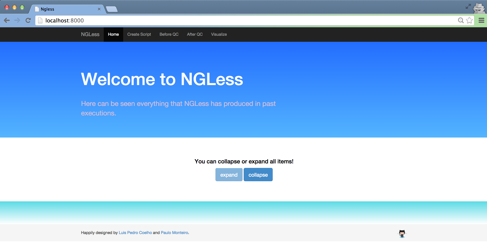

Example Description
-------------------

This example will use data from a real experiment stored at EMBL-EBI. The data can be accessed at http://www.ebi.ac.uk/ena/data/view/SRP023199 and represent **HeLa cells**. The idea is to preprocess the data set, map it against the human genome and count the reads that overlap with known genes.

We will use the fastQ file ftp://ftp.sra.ebi.ac.uk/vol1/fastq/SRR867/SRR867735/SRR867735.fastq.gz that can be accessed in the table, on column **Sample accession**, with value SAMN02179475.

Create your script
------------------

Since the web server is opened now you can start to create your script. Start by clicking in the tab **Create Script** from the navigation menu, as in the following image:

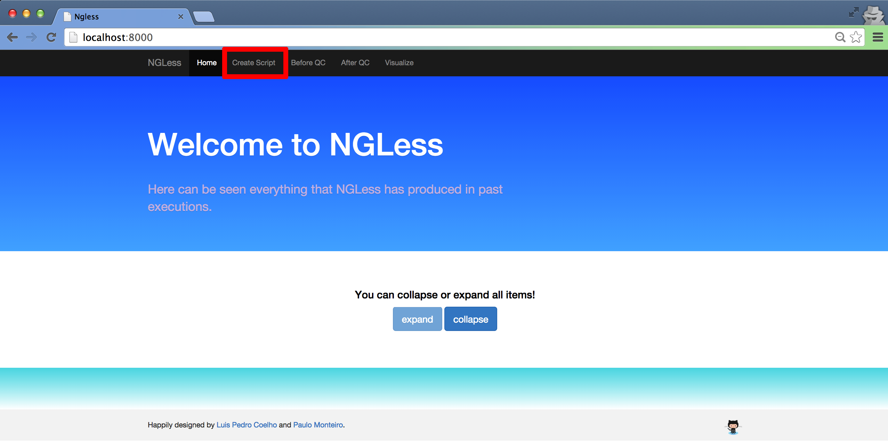

After clicking, a page as the following should be displayed.

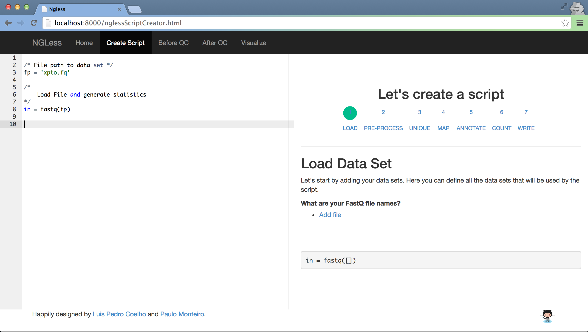

As you can see, there are two ways to create your scripts. At the left there is a text editor that allows to edit and create your scripts and at the right is a wizard that generates a script with little to no effort.

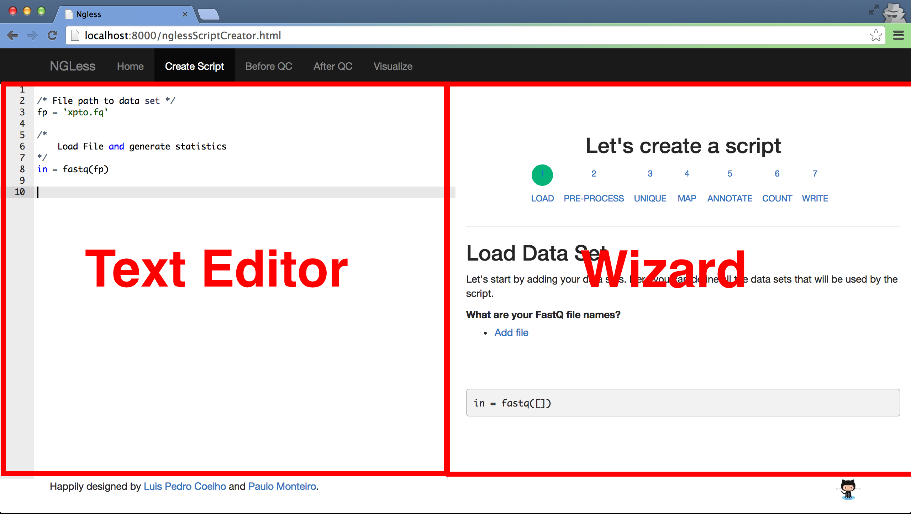

Choose the mode that will make you feel more comfortable with.

Text Editor
-------------

Load fastQ file
~~~~~~~~~~~~~~~

Before creating the whole script lets start by understanding our data set. This first step will allow you to perform quality control. 

Using the **text editor**, type:

.. code-block::

	ngless "0.0"

	/* load the data set */
	input = fastq('SRR867735.fastq.gz')

You can now save the script (as **test.ngl** for example) to the directory where the file 'SRR867735.fastq.gz' is and run ngless.
::

	$ ngless test.ngl

Using the web server you can visualize key information about a data set. At 'Before QC' there will be the result of the execution.

.. image:: ../images/resultBeforeQC.png

We can now see that the data set has:
	
	- +- 50% of guanine and cytosine.

	- Follows the Encoding Sanger.

	- Has 32456161 sequences

	- And all sequences have the same length (50).

Also, by analyzing the plot we can see that the first 3 base pairs, on average, have the lowest quality (31.0). So, a good preprocess starts by removing the first 3 base pairs. 

Feel free to explore all the available statistics.

Preprocess
~~~~~~~~~~~~~~

For the preprocess we will:

	- Remove the first **3** base pairs.

	- Substrim with a minimum quality of **15**.

	- Discard if the length of a read is **smaller than 20**. 

Let's add the following code to the already existent code in the Text Editor.

.. code-block::
	
	preprocess(input) using |read|:
            read = read [3:] // Discard from position 0 until 3 (excluded).
    	    read = substrim(read, min_quality=15)
    	    if len(read) < 20:
	         discard

This will generate quality control that will be detailed at the execute section.

Map
~~~~~~~~~~~~~~

After adding the preprocess code to the Text Editor, it's time to map against the human genome. Since the human genome is provided by default, you can simply do:

.. code-block:: 

	/* reference genome */
	human = 'hg19'
	mapped = map(input, reference=human)

Annotate
~~~~~~~~~~~~~~

We are only interested in the human genes so lets annotate the map results with the only feature being genes. Since we used a genome provided by NGLess, we will also use the annotation provided by default:

.. code-block:: 
	
	/* annotation features */
	feats = [{gene}]
	annotated = annotate(mapped, strand={no}, mode={union}, ambiguity={deny}, features=feats)

Count & Write
~~~~~~~~~~~~~~

Annotation will annotate the results but won't store them. In order to count and save them you have to write the counts of the annotation to somewhere in your disk:

.. code-block::

	/* write counts to disk */
	counts = count(annotated)
	write(counts, verbose={yes}, ofile="samples/CountsResult.txt")

Final Script
~~~~~~~~~~~~~~

At the end, your Text Editor should have the following code:

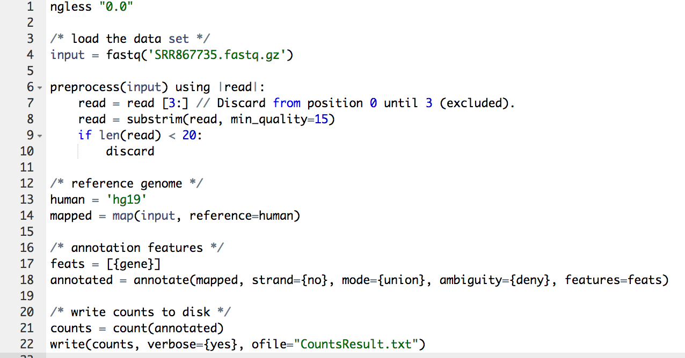

Jump to section **Execute** to run the script and see the results.

Wizard
--------

With the wizard you should start like in the following image:

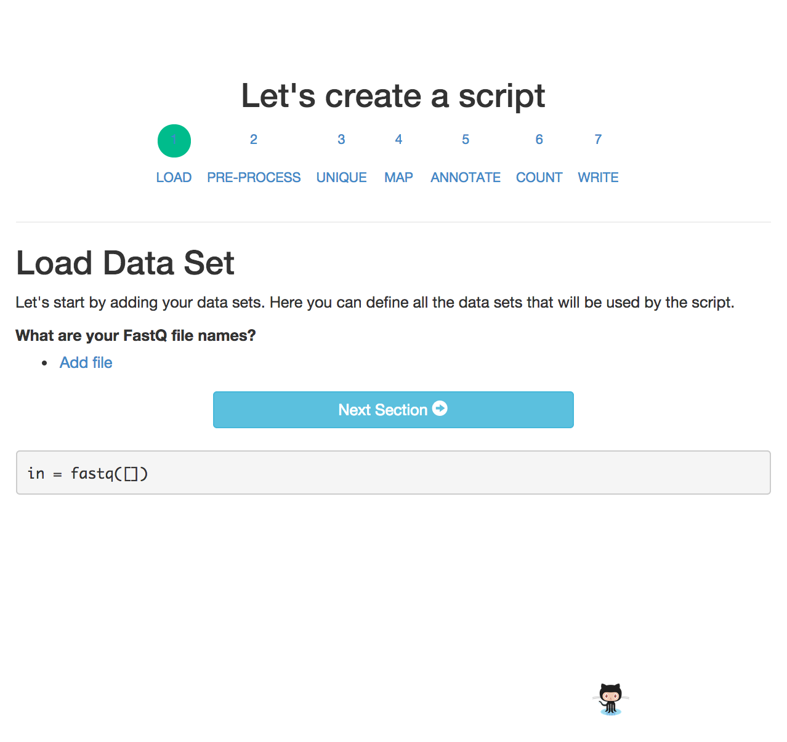

Load fastQ file
~~~~~~~~~~~~~~~

To load the file 'SRR867735.fastq.gz' you should click 'add file' which will open a box that you can type the file name.

.. image:: ../images/wizard2.png

Important to notice in the image also that the script is created in real time. This means that you can see the modifications while making them.

You can now click in 'Next Section' to go to Pre-Process.

Preprocess
~~~~~~~~~~~~~~

At the preprocess we are going to:

	a) Remove the first **3** base pairs.

	b) Substrim with a minimum quality of **15**.

	c) Discard if the length of a read is **smaller than 20**. 

To do a), since we want to remove the first 3 base pairs, we need to make a left trim of 3. You can see at the bottom the script changing while making the modifications. 

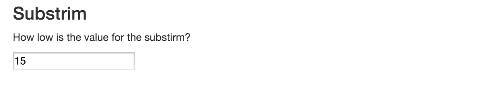

For b) we want to make a substrim and for that you should update the field as shown in the following image:

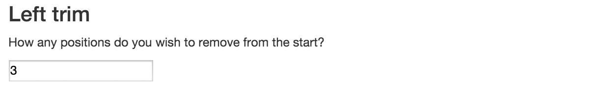

For c) we want to make a discard and since this is a common operation our wizard as a special field for that:

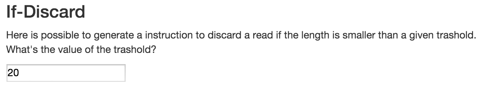

Now, after filling all the values, the script displayed at the bottom should look as follows:

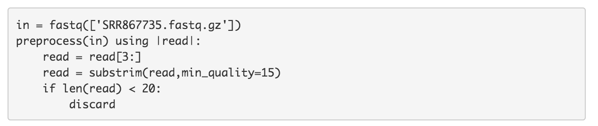

Since the unique operation is not applied, click twice in 'Next Section' to jump to Map.

Map
~~~~~~~~~~~~~~

Since the human genome is provided by default, you can simply fill the reference field with 'hg19':

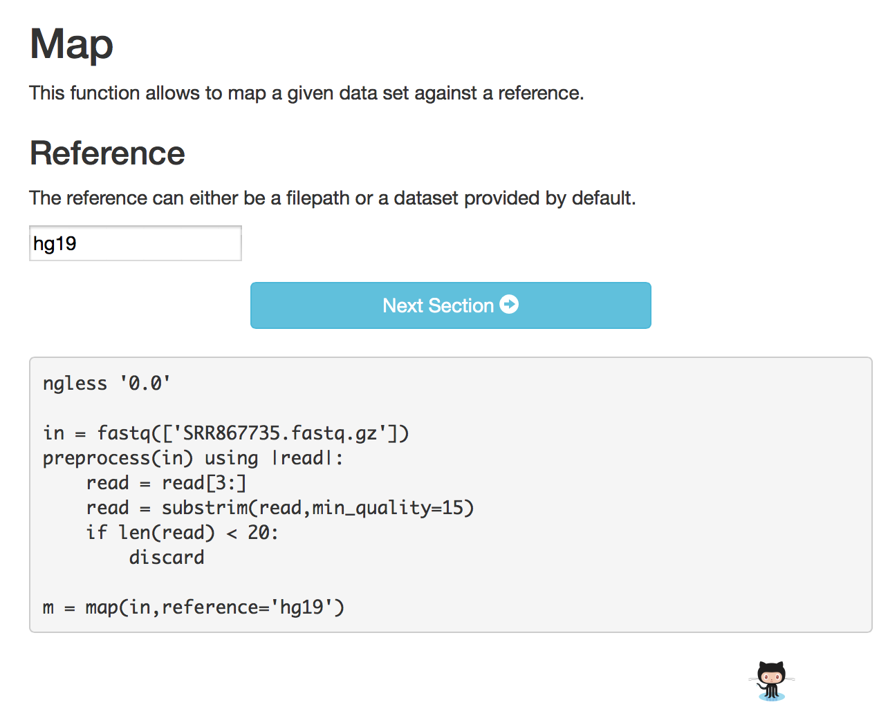

Your script should look exactly like the script at the end of the previous image.

You can now click in 'Next Section' to go to Annotate.

Annotate
~~~~~~~~~~~~~~

We are only interested in the human genes so lets annotate the map results with only the genes as features.

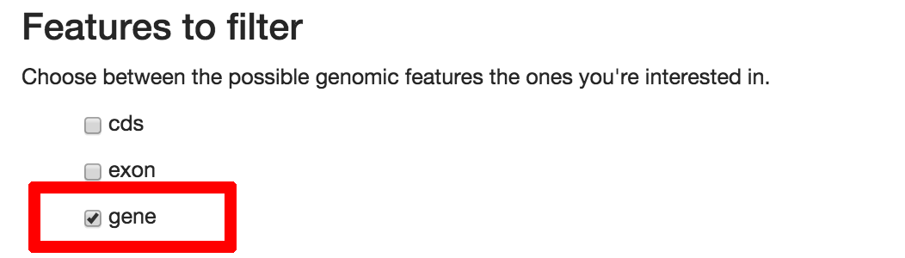

The mode of annotation we are interested in is the 'union':

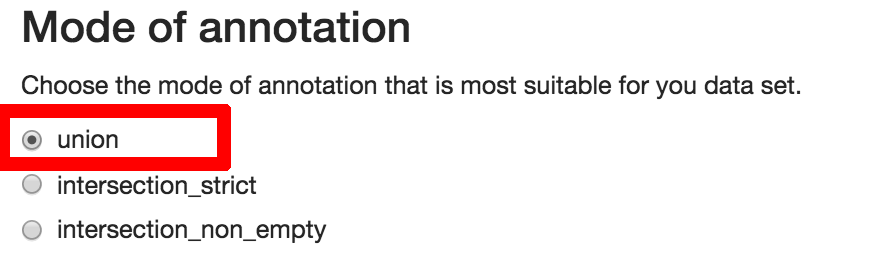

**Do not allow** ambiguity when deciding a feature.

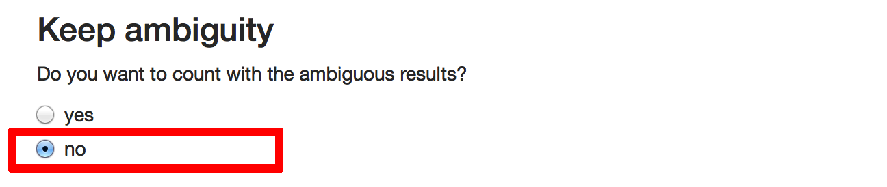

Allow the matches to be in any strand, positive or negative.

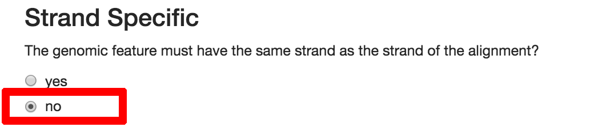

Your script should look exactly like this:

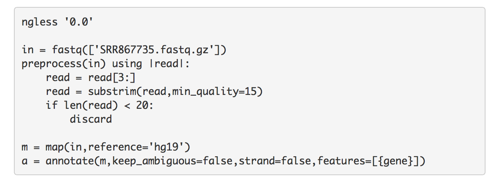

You can now click in 'Next Section' to go to Count.

Count
~~~~~~~~~~~~~~~

We are only interested in counting genes. It's quite redundant choosing 'gene' again but while using the wizard this field is mandatory.

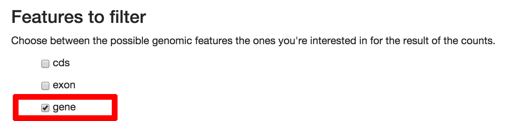

You can now click in 'Next Section' to go to Write.

Write
~~~~~~

In the write you should fill the file destiny as 'CountResults.txt' and your final script should look like the following image:

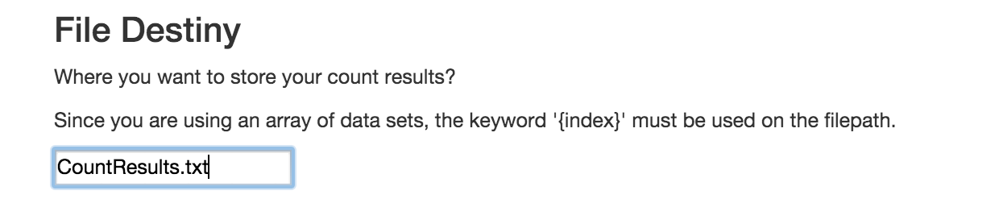

You can now click in 'Next Section' to complete the script generation.

Final Script
~~~~~~~~~~~~

At the end you should see the final script:

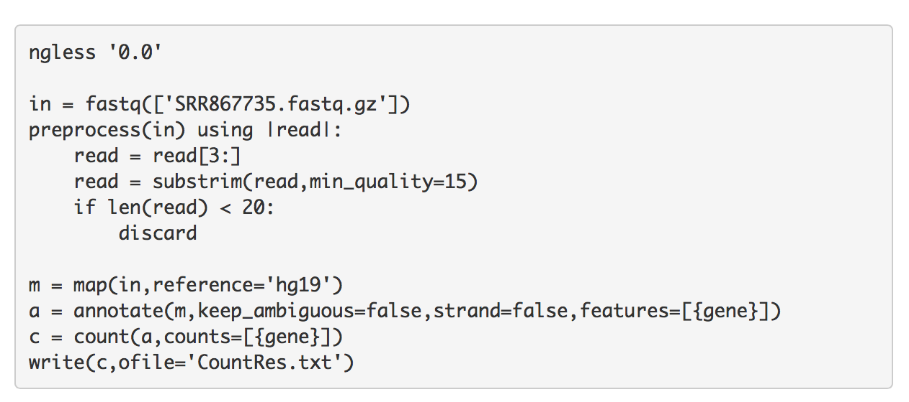

Jump to section **Execute** to run the script and see the results.

Execute
--------

You can now save the script (as **test.ngl** for example) to the directory where the file 'SRR867735.fastq.gz' is and run ngless.
::

	$ ngless test.ngl

As a result of the execution, should be returned the following:

.. code-block:: bash

	Total reads: 32457019
	Total reads aligned: 31316462[96.49%]
	Total reads Unique map: 25218844[80.53%]
	Total reads Non-Unique map: 6097618[19.47%]
	Total reads without enough qual: 0

These are statistics of the map of the file against the human genome.

All other results can be accessed through the web server. The results are in the following (sub)sections.

After quality control
~~~~~~~~~~~~~~~~~~~~~

As the function preprocess was used, quality control is generated.

It can be visualized at the tab 'After QC' as shown next:

.. image :: ../images/resultAfterQC.png

As can be seen the quality has increased and the minimum quality is now 34. Also, the minimum and maximum ([min,max]) sequence decreased from [50,50] to [20,47] which implies a decrease in both the sequence length minimum and maximum, 30 and 3 respectively. 

Counts
~~~~~~~~~~~~~~~~~~~~

In order to access the top gene counts, you can use the 'Visualize' tab in the navigation menu. 

.. image:: ../images/resultVisualize.png

---------------------------------
---- Talk about the results -----
---------------------------------

You can click on the **counts column** that will allow you to sort the counts in descending order. By default are shown 20 genes at a time, but you can define the amount to either 10, 25, 50 or 100.

Also if you want to edit the file directly you can by opening the file **'CountResults.txt'** with your preferred text editor.
