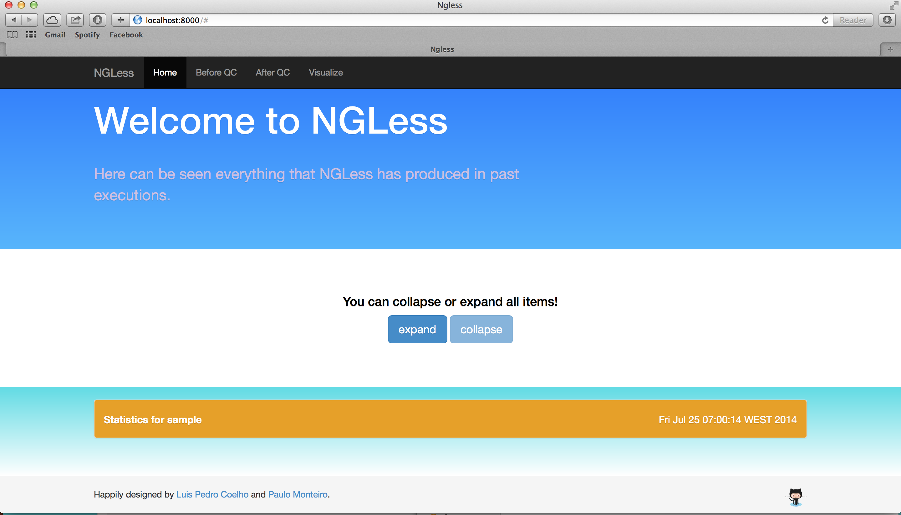
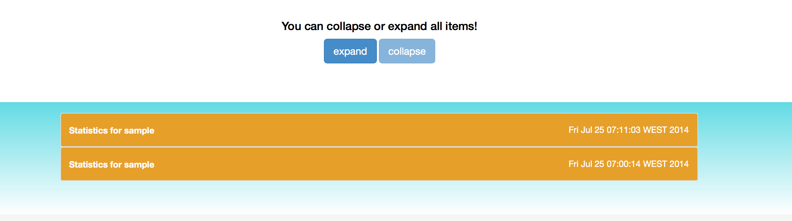
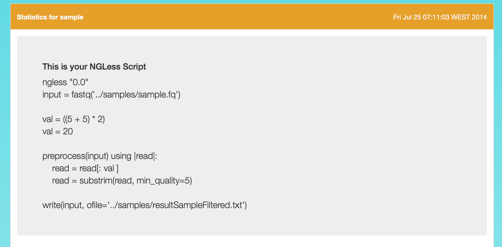
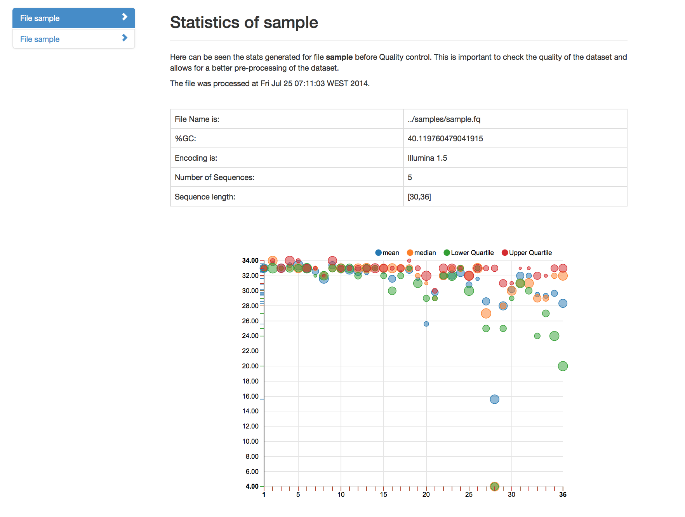
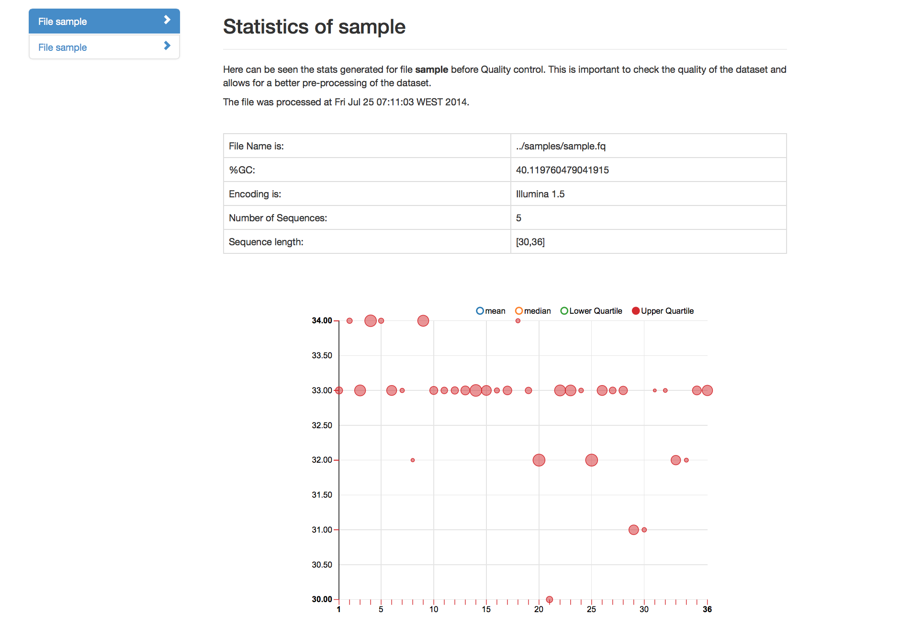
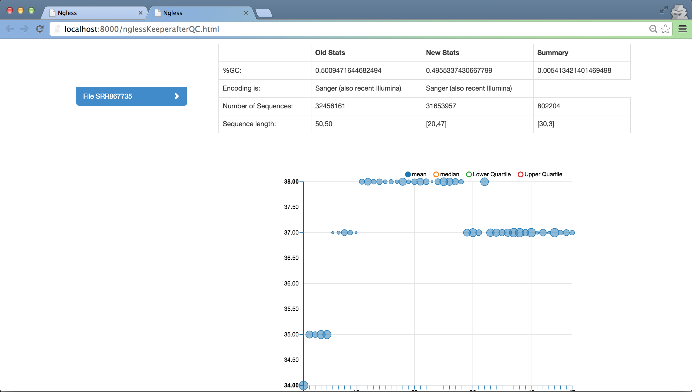
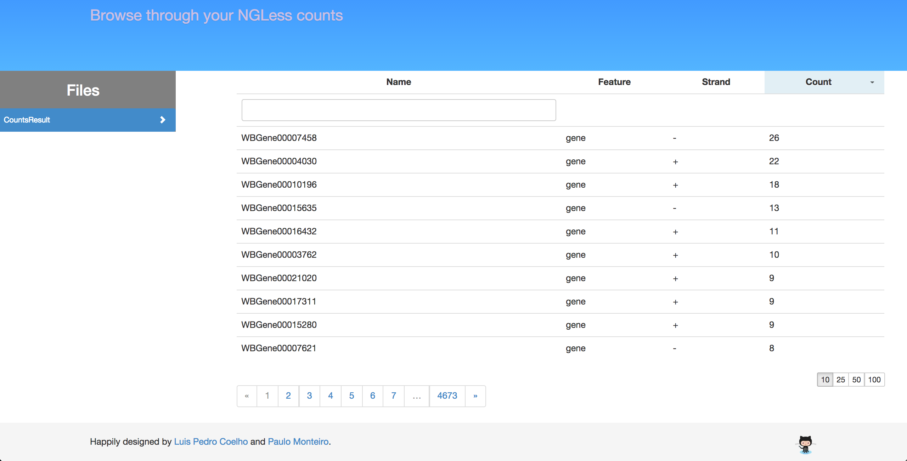

.. _Visualization:

=================
Visualization
=================

Launch
-----------------

In order to visualize the script results a web server is launched with the following command.
::

  $ ngless visualizemode <script_location.ngless_output>
  > Launching WebServer at: 8000
  > You can access it at: http://localhost:8000   

To change the port from the default 8000, as to be used the flag **-p** [int] or --port=[Int].

If everything went correctly, you should see something like this.
    

Visualize Runs
-----------------
All prior executions of NGLess, for a script, can be consulted and are organized in a drop down list fashion.

Each box has information outside as the data set name that we used and the date and time of the execution.

If we open one box, there can be seen three main things: 

- The executed script
- The quality control at the beginning
- Quality controls after the pre-processing (this one being optional).

Is crucial to save the script that lead to some results. For that reason, scripts are always associated with the 
results that they generate, allowing this way to easily reproduce an experiment. The script can be 
consulted has shown in the next figure.

Before Quality Control
----------------------

This quality control is always present and it allows to visualize the quality and basic info about a given data set. 

The basic information provided is:

- The original file path
- The percentage of guanine and cytosine in the whole data set.
- Encoding prediction.
- The number of sequences.
- The minimum and maximum sequence length of the entire data set.

Not only basic information is supplied, but also statistical calculations are made. These statistics are made in relation to each base pair, and are presented in an interactive plot that allows show/hide these metrics. 

The used statistical measures are in relation to each base pair and are:

- Mean
- Median
- Lower Quartile (25%)
- Upper Quartile (75%)

The Quality control can be accessed in the web interface through the tab **before QC** and a vertical menu allows to choose which dataset in question. Can be seen an example next:

The plot can be adjusted to show one statistic at a time, and the plot limits adapt to the presented values. An image of only the upper quartile shown looks like the following:

After Quality Control
----------------------
The quality control, in terms of statistics, is very similar to the represented at section Before Quality Control. The main different is a correlation in the results **before vs after**.

At the table, the column summary represents the difference in %GC, number of sequences and minimum/maximum sequence length from the before QC to after QC. Encoding can't change and for that reason remains the same.

From the results can be seen that:

- Decreased 0.005 in %GC.
- 802204 sequences were removed
- the minimum and maximum sequences decreased 30 and 3 respectively.

Visualise results
----------------------

This option allows to visualise the results from the annotation. It's possible to filter by a given gene id and sort in ascending or descending order by the number of counts. Is also possible to create a top 10,25,50,100 by choosing one of the possible values from the menu at the bottom right.

Can be seen, in the previous figure, a top 10 example, named 'CountResults', where the features are only genes with the column counts sorted descending. 

