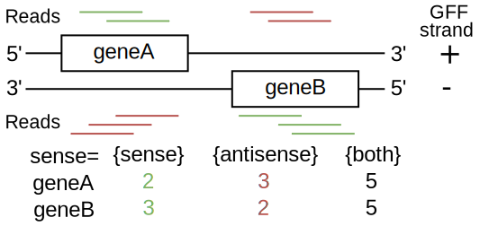

.. _Functions:

========================
NGLess Builtin Functions
========================

These are the built-in NGLess functions. Make sure to check the `standard
library <stdlib.html>`__ as well.

fastq
-----

Function to load a FastQ file::

  in = fastq('input.fq')

Argument:
~~~~~~~~~
String

Return:
~~~~~~~
ReadSet

Arguments by value:
~~~~~~~~~~~~~~~~~~~
+---------------+----------------------+------------+----------------+
| Name          | Type                 | Required   | Default Value  |
+===============+======================+============+================+
| encoding      | Symbol               |  no        | {auto}         |
|               | ({auto}, {33}, {64}, |            |                |
|               | {sanger}, {solexa})  |            |                |
+---------------+----------------------+------------+----------------+
| interleaved   | Bool                 |  no        | False          |
+---------------+----------------------+------------+----------------+

Possible values for ``encoding`` are:

- ``{sanger}`` or ``{33}`` assumes that the file is encoded using sanger
  format. This is appropriate for newer Illumina outputs.
- ``{solexa}`` or ``{64}`` assumes that the file is encoded with a 64 offset.
  This is used for older Illumina/Solexa machines.
- ``{auto}``: use auto detection. This is the default.

If ``interleaved`` is ``True``, then the input is assumed to be interleaved.
This means that paired-end reads are represented by each mate being adjacent in
the file with the same identifier (if the identifiers end with ``/1`` and
``/2``, but are otherwise identical, this is still considered a match). Thus,
an interleaved file can contain both paired-end and single-end reads.

When loading a data set, quality control is carried out and statistics can be
visualised in a graphical user interface (GUI). Statistics calculated are:

- percentage of guanine and cytosine (%GC)
- number of sequences
- minimum/maximum sequence length
- mean, median, lower quartile and upper quality quartile for each sequence
  position

If not specified, the encoding is guessed from the file.

Gzip and bzip2 compressed files are transparently supported (determined by file
extension, ``.gz`` and ``.bz2`` for gzip and bzip2 respectively).

paired
------

Function to load a paired-end sample, from two FastQ files::

  in = paired('input.1.fq', 'input.2.fq', singles='input.3.fq')

``paired()`` is an exceptional function which takes **two** unnamed arguments,
specifying the two read files (first mate and second mate) and an optional
``singles`` file (which contains unpaired reads).

Argument:
~~~~~~~~~
String, String

Return:
~~~~~~~
ReadSet

Arguments by value:
~~~~~~~~~~~~~~~~~~~
+---------------+----------------------+------------+----------------+
| Name          | Type                 | Required   | Default Value  |
+===============+======================+============+================+
| encoding      | Symbol               |  no        | {auto}         |
|               | ({auto}, {33}, {64}, |            |                |
|               | {sanger}, {solexa})  |            |                |
+---------------+----------------------+------------+----------------+
| singles       | String               | no         | -              |
+---------------+----------------------+------------+----------------+

The ``encoding`` argument has the same meaning as for the ``fastq()`` function:

- ``{sanger}`` or ``{33}`` assumes that the file is encoded using sanger
  format. This is appropriate for newer Illumina outputs.
- ``{solexa}`` or ``{64}`` assumes that the file is encoded with a 64 offset.
  This is used for older Illumina/Solexa machines.
- ``{auto}``: use auto detection. This is the default.

load_fastq_directory
--------------------

.. versionadded:: NGLess 1.2
    Previously, this function was available in the ``mocat`` module as
    ``load_mocat_sample``. Now, it is a builtin function. Even though the
    concept originated with MOCAT, this function is now more flexible than the
    original MOCAT implementation.

This function takes a directory name and returns a set of reads by scanning the
directory for (compressed) FastQ files. This is slightly more flexible than
MOCAT2 in terms of the patterns in matches. In particular, the following
extensions are accepted:

- ``fq``
- ``fq.gz``
- ``fq.bz2``
- ``fastq``
- ``fastq.gz``
- ``fastq.bz2``

Paired-end reads are assumed to be split into two files, with matching names
with ``.1``/``.2`` appended. ``_1``/``_2`` as is used by the European Nucleotide
Archive (ENA) is also accepted.

If paired-end reads have been pre-filtered, an unpaired/single file is often available.
``load_fastq_directory`` recognizes the suffix ``single``. In the following example,
all three files are read as one group::

    sample
    ├── sample.pair.1.fq.gz
    ├── sample.pair.2.fq.gz
    └── sample.single.fq.gz

Arguments by value:
~~~~~~~~~~~~~~~~~~~
+------------+--------------+------------+----------------+
| Name       | Type         | Required   | Default Value  |
+============+==============+============+================+
| name       | String       |  no        | ""             |
+------------+--------------+------------+----------------+

Argument
~~~~~~~~

String (directory path)

Returns
~~~~~~~

ReadSet

group
-----

Groups a list of ReadSet objects into a single ReadSet::

    rs1 = paired('data0.1.fq.gz', 'data0.2.fq.gz')
    rs2 = paired('data1.1.fq.gz', 'data1.2.fq.gz')
    rs = group([rs1, rs2], name='input')

Arguments by value:
~~~~~~~~~~~~~~~~~~~
+------------+--------------+------------+----------------+
| Name       | Type         | Required   | Default Value  |
+============+==============+============+================+
| name       | String       |  no        | ""             |
+------------+--------------+------------+----------------+

Argument
~~~~~~~~

List of ReadSet

Returns
~~~~~~~

ReadSet

samfile
-------

Loads a SAM file::

    s = samfile('input.sam')

This function takes no keyword arguments. BAM files are also supported
(determined by the filename), as are ``sam.gz`` files.

Returns
~~~~~~~

MappedReadSet

Arguments by value:
~~~~~~~~~~~~~~~~~~~
+---------------+----------------------+------------+----------------+
| Name          | Type                 | Required   | Default Value  |
+===============+======================+============+================+
| name          | String               |  no        | -              |
+---------------+----------------------+------------+----------------+
| header        | String               |  no        | -              |
+---------------+----------------------+------------+----------------+

.. versionadded:: 0.7
    The ``header`` argument was added in version 0.7

- The ``name`` argument names the group (for ``count()``, for example).
- The ``headers`` argument can be used if the SAM headers are kept in a
  separate file.

qcstats
-------

.. versionadded:: 0.6
    This functionality was not available prior to 0.6

Returns the auto-computed statistics::

    write(qcstats({fastq}), ofile='fqstats.txt')

Returns
~~~~~~~

CountsTable

Argument
~~~~~~~~

Defines what type of statistics to return. Currently, two options are available

- ``{fastq}``: FastQ statistics
- ``{mapping}``: Mapping statistics

countfile
---------

Loads a TSV file::

    c = countfile('table.tsv')

This function takes no keyword arguments. If the filename ends with ".gz", it
is assumed to be a gzipped file.

Returns
~~~~~~~

CountTable

as_reads
--------

Converts from a ``MappedReadSet`` to a ``ReadSet``::

    reads = as_reads(samfile('input.sam'))

discard_singles
---------------

.. versionadded:: NGLess 1.1

Throws away unpaired reads from a ``ReadSet``::

    reads = discard_singles(reads)

Argument
~~~~~~~~

ReadSet

Returns
~~~~~~~

ReadSet

unique
------

Function that given a set of reads, returns another which only retains a
set number of copies of each read (if there are any duplicates). An
example::

    input = unique(input, max_copies=3)

Argument:
~~~~~~~~~

ReadSet

Return:
~~~~~~~

ReadSet

Arguments by value:
~~~~~~~~~~~~~~~~~~~

+---------------+--------------+------------+----------------+
| Name          | Type         | Required   | Default Value  |
+===============+==============+============+================+
| max\_copies   | Integer      |  no        | 2              |
+---------------+--------------+------------+----------------+

The optional argument **max_copies** allows to define the number of tolerated
copies (default: 2).

Two short reads with the same nucleotide sequence are considered copies,
independently of quality and identifiers.

This function is currently limited to single-end samples.

preprocess
----------

This function executes the given block for each read in the ReadSet.  Unless
the read is **discarded**, it is transferred (after transformations) to the
output. For example::

    inputs = preprocess(inputs) using |read|:
        read = read[3:]

Argument:
~~~~~~~~~

ReadSet

Return:
~~~~~~~

ReadSet

Arguments by value:
~~~~~~~~~~~~~~~~~~~

+---------------+--------------+------------+----------------+
| Name          | Type         | Required   | Default Value  |
+===============+==============+============+================+
| keep\_singles | bool         |  no        | true           |
+---------------+--------------+------------+----------------+

When a paired-end input is being preprocessed in single-mode (i.e., each mate
is preprocessed independently, it can happen that on eof the mates is
discarded, while the other is kept). The default is to collect these into the
singles pile. If ``keep_singles`` if false, however, they are discarded.

This function also performs quality control on its output.

map
---

The function map, maps a ReadSet to reference. For example::

    mapped = map(input, reference='sacCer3')
    mapped = map(input, fafile='ref.fa')

Argument:
~~~~~~~~~

ReadSet

Return:
~~~~~~~

MappedReadSet

Arguments by value:
~~~~~~~~~~~~~~~~~~~

+------------------------+-------------+------------+----------------+
| Name                   | Type        | Required   | Default Value  |
+========================+=============+============+================+
| reference              | String      | no         | -              |
+------------------------+-------------+------------+----------------+
| fafile                 | String      | no         | -              |
+------------------------+-------------+------------+----------------+
| block_size_megabases   | Integer     | no         | -              |
+------------------------+-------------+------------+----------------+
| mode_all               | Bool        | no         | -              |
+------------------------+-------------+------------+----------------+
| __extra_args           | [String]    | no         | []             |
+------------------------+-------------+------------+----------------+

The user must provide either a path to a FASTA file in the ``fafile`` argument
or the name of a builtin reference using the ``reference`` argument. The
``fafile`` argument supports `search path expansion <searchpath.html>`__.

A list of datasets provided by NGLess can be found at :ref:`Organisms`.

To use any of these, pass in the name as the reference value::

    mapped_hg19 = map(input, reference='hg19')

NGLess does not ship with any of these datasets, but they are downloaded
lazily: i.e., the first time you use them, NGLess will download and cache them.
NGLess will also index any database used the first time it is used.

The option ``block_size_megabases`` turns on low memory mode (see the
corresponding section in the `mapping documentation <Mapping.html>`__)

The option ``mode_all=True`` can be passed to include all alignments of both
single and paired-end reads in the output SAM/BAM.

Strings passed as ``__extra_args`` will be passed verbatim to the mapper.

mapstats
--------

Computes some basic statistics from a set of mapped reads (number of reads,
number mapped, number uniquely mapped).

Argument
~~~~~~~~
MappedReadSet

Return
~~~~~~
CountTable

select
------

`select` filters a MappedReadSet. For example::

    mapped = select(mapped, keep_if=[{mapped}])

Argument:
~~~~~~~~~

MappedReadSet

Return:
~~~~~~~

MappedReadSet

Arguments by value:
~~~~~~~~~~~~~~~~~~~

+-------------+-------------+------------+----------------+
| Name        | Type        | Required   | Default Value  |
+=============+=============+============+================+
| keep_if     | [Symbol]    | no         | -              |
+-------------+-------------+------------+----------------+
| drop_if     | [Symbol]    | no         | -              |
+-------------+-------------+------------+----------------+
| paired      | Bool        | no         | true           |
+-------------+-------------+------------+----------------+

At least one of ``keep_if`` or ``drop_if`` should be passed, but not both. They accept the following symbols:

- ``{mapped}``: the read mapped
- ``{unmapped}``: the read did not map
- ``{unique}``: the read mapped to a unique location

If ``keep_if`` is used, then reads are kept if they pass **all the conditions**.
If ``drop_if`` they are discarded if they fail to **any condition**.

By default, ``select`` operates on a paired-end read as a whole. If
``paired=False`` is passed, however, then link between the two mates is not
considered and each read is processed independently.

count
-----

Given a file with aligned sequencing reads (MappedReadSet), ``count()`` will produce
a counts table depending on the arguments passed. For example::

    counts = count(mapped, min=2, mode={union}, multiple={dist1})

Argument:
~~~~~~~~~

MappedReadSet

Return:
~~~~~~~

CountTable

Arguments by value:
~~~~~~~~~~~~~~~~~~~

+-------------------+-----------------+------------+----------------+
| Name              | Type            | Required   | Default value  |
+===================+=================+============+================+
| gff\_file         | String          | no*        |  -             |
+-------------------+-----------------+------------+----------------+
| functional\_map   | String          | no*        |  -             |
+-------------------+-----------------+------------+----------------+
| features          | [ String ]      | no         | 'gene'         |
+-------------------+-----------------+------------+----------------+
| subfeatures       | [ String ]      | no         | -              |
+-------------------+-----------------+------------+----------------+
| mode              | Symbol          | no         | {union}        |
+-------------------+-----------------+------------+----------------+
| multiple          | Symbol          | no         | {dist1}        |
+-------------------+-----------------+------------+----------------+
| sense             | Symbol          | no         | {both}         |
+-------------------+-----------------+------------+----------------+
| normalization     | Symbol          | no         | {raw}          |
+-------------------+-----------------+------------+----------------+
| include_minus1    | Bool            | no         | true           |
+-------------------+-----------------+------------+----------------+
| min               | Integer         | no         | 0              |
+-------------------+-----------------+------------+----------------+
| discard_zeros     | Bool            | no         | false          |
+-------------------+-----------------+------------+----------------+
| reference         | String          | no         | ""             |
+-------------------+-----------------+------------+----------------+

If the features to count are ``['seqname']``, then each read will be assigned
to the name of reference it matched and only an input set of mapped reads is
necessary. For other features, you will need extra information. This can be
passed using the ``gff_file`` or ``functional_map`` arguments. If you had
previously used a ``reference`` argument for the ``map()`` function, then
you can also leave this argument empty and NGLess will use the corresponding
annotation file.

The ``gff_file`` and ``functional_map`` arguments support `search path
expansion <searchpath.html>`__.

The ``functional_map`` should be a tab-separated file where the first column is
the sequence name and the other columns are the annotations. This is often used
for gene catalogues and can be produced by `eggnog-mapper
<http://eggnog-mapper.embl.de/>`__.

``features``: which features to count. If a GFF file is used, this refers to
the "features" field.

``subfeatures``: this is useful in GFF-mode as the same feature can encode
multiple attributes (or, in NGLess parlance, "subfeatures"). By default, NGLess
will look for the ``"ID"`` or ``"gene_id"`` attributes.

``mode`` indicates how to handle reads that (partially) overlap one or more features.
Possible values for ``mode`` are ``{union}``, ``{intersection_non_empty}`` and
``{intersection_strict}`` (default: ``{union}``). For every position of a mapped read,
collect all features into a set. These sets of features are then handled in different modes.

-  ``{union}`` the union of all the sets. A read is counted for every feature it overlaps.
-  ``{intersection_non_empty}`` the intersection of all non-empty sets. A read is only counted for features it exclusively overlaps, even if partially.
-  ``{intersection_strict}`` the intersection of all the sets. A read is only counted if the entire read overlaps the same feature(s).

Consider the following illustration of the effect of different ``mode`` options::

    Reference *************************
    Feature A      =======
    Feature B            ===========
    Feature C                 ========
    Read_1       -----
    Read_2             -----
    Read_3                    -----
    Position     12345 12345  12345

    Read position          1    2    3    4    5
    Read_1 feature sets    -    -    A    A    A
    Read_2 feature sets    A    A  A,B    B    B
    Read_3 feature sets  B,C  B,C  B,C  B,C  B,C

               union  intersection_non_empty  intersection_strict
    Read_1         A                       A                    -
    Read_2     A & B                       -                    -
    Read_3     B & C                   B & C                B & C

How to handle multiple mappers (inserts which have more than one "hit" in the
reference) is defined by the ``multiple`` argument:

- ``{unique_only}``: only use uniquely mapped inserts
- ``{all1}``: count all hits separately. An insert mapping to 4 locations adds 1 to each location
- ``{1overN}``: fractionally distribute multiple mappers. An insert mapping to 4 locations adds 0.25 to each location
- ``{dist1}``: distribute multiple reads based on uniquely mapped reads. An insert mapping to 4 locations adds to these in proportion to how uniquely mapped inserts are distributed among these 4 locations.

The argument ``sense`` should be used when the data are strand-specific and
determines which strands should be considered:

- ``{both}`` (default): a read is considered overlapping with a feature independently of whether maps to the same or the opposite strand.
- ``{sense}``: a read has to map to the same strand as the feature to be considered overlapping.
- ``{antisense}``: a read has to map to the **opposite** strand to be considered overlapping.

If you have strand-specific data, then ``{sense}`` is probably appropriate, but
with some protocols ``{antisense}`` is actually the correct version.

The following illustration exemplifies how counting would be performed.

**Note**: before version **1.1**, there was an argument ``strand`` which was
either ``True`` or ``False`` mapping to ``{sense}`` and ``{both}``
respectively. ``strand`` is still supported, but deprecated.

``min`` defines the minimum amount of overlaps a given feature must have, at
least, to be kept (default: 0, i.e., keep all counts). If you just want to
discard features that are exactly zero, you should set the ``discard_zeros``
argument to True.

``normalization`` specifies if and how to normalize to take into account feature size:

- ``{raw}`` (default) is no normalization
- ``{normed}`` is the result of the ``{raw}`` mode divided by the size of the
  feature
- ``{scaled}`` is the result of the ``{normed}`` mode scaled up so that the
  total number of counts is identical to the ``{raw}`` (within rounding error)
- ``{fpkm}`` is *fragments per 1000 bp per million fragments*, so it is normalized
  by both the size of the feature and the number of fragments.

Unmapped inserts are included in the output if ``{include_minus1}`` is true
(default: ``False``).

.. versionadded:: 0.6
    Before version 0.6, the default was to **not** include the -1 fraction.

substrim
--------

Given a read finds the longest substring, such that all bases are of at least
the given quality. The name is a constraction of "substring trim".  For
example::

    read = substrim(read, min_quality=25)

Argument:
~~~~~~~~~

ShortRead

Return:
~~~~~~~

ShortRead

Arguments
~~~~~~~~~

+-------------------------+--------------+------------+----------------+
| Name                    | Type         | Required   | Default Value  |
+=========================+==============+============+================+
| min_quality             | Integer      |  yes       |	               |
+-------------------------+--------------+------------+----------------+

``min_quality`` parameter defines the minimum quality accepted.

endstrim
--------

Given a read, trim from both ends (5' and 3') all bases below a minimal
quality. For example::

    read = endstrim(read, min_quality=25)

Argument:
~~~~~~~~~

ShortRead

Return:
~~~~~~~

ShortRead

Arguments
~~~~~~~~~

+-------------------------+--------------+------------+----------------+
| Name                    | Type         | Required   | Default Value  |
+=========================+==============+============+================+
| min_quality             | Integer      |  yes       |	               |
+-------------------------+--------------+------------+----------------+

``min_quality`` parameter defines the minimum quality value.

smoothtrim
----------

This trims with the same algorithm as substrim but uses a sliding window
to average base qualities. For example::

    read = smoothtrim(read, min_quality=15, window=4)

Quality values of bases at the edges of each read are repeated to allow
averaging with quality centered on each base. For instance a read::

    Sequence   A  T  C  G    with a window     A  A  T  C  G  G
    Quality   28 25 14 12  of size 3 becomes  28 28 25 14 12 12

and is smoothed::

    Seq        A  A  T  C  G  G   smoothed quality   A  T  C  G
    Qual      28 28 25 14 12 12         --->        27 22 17 13
    Windows    |-----|            (28 + 28 + 25) / 3 = 27     ^
     ...          |-----|         (28 + 25 + 14) / 3 = 22     |
                     |-----|      (25 + 14 + 12) / 3 = 17     !
                        |-----|   (14 + 12 + 12) / 3 = 13 ----+

at which point ``substrim`` is applied for trimming.

Quality scores are returned to their original value after trimming.

Argument:
~~~~~~~~~

ShortRead

Return:
~~~~~~~

ShortRead

Arguments
~~~~~~~~~

+-------------------------+--------------+------------+----------------+
| Name                    | Type         | Required   | Default Value  |
+=========================+==============+============+================+
| min_quality             | Integer      |  yes       |	               |
+-------------------------+--------------+------------+----------------+
| window                  | Integer      |  yes       |	               |
+-------------------------+--------------+------------+----------------+

``min_quality`` parameter defines the minimum quality accepted for the
sub-sequence.
``window`` parameter defines the number of bases to average over.

write
-----

Writes an object to disk.

Argument:
~~~~~~~~~

Any

Return:
~~~~~~~

Void

Arguments by value:
~~~~~~~~~~~~~~~~~~~

+---------------+-------------+------------+----------------+
| Name          | Type        | Required   | Default Value  |
+===============+=============+============+================+
| ofile         | String      | yes        | -              |
+---------------+-------------+------------+----------------+
| format        | String      | no         | -              |
+---------------+-------------+------------+----------------+
| format\_flags | [Symbol]    | no         | []             |
+---------------+-------------+------------+----------------+
| comment       | String      | no         | -              |
+---------------+-------------+------------+----------------+
| auto_comments | String      | no         | -              |
+---------------+-------------+------------+----------------+

The argument ``ofile`` is where to write the content.

The output format is typically determined from the ``ofile`` extension, but the
``format`` argument overrides this. Supported formats:

- CountsTable: ``{tsv}`` (default) or ``{csv}``: use TAB or COMMA as a delimiter
- MappedReadSet: ``{sam}`` (default) or ``{bam}``
- ReadSet: FastQ format, optionally compressed (depending on the extension).

By default, ReadSets are written a set of one to three FastQ files (2 files for
the paired-end reads, and one file for the single-end ones, with empty files
omitted). ``format\_flags`` (since NGLess 0.7) currently supports only
``{interleaved}`` to output an interleaved FastQ file instead.

Compression is inferred from the ``ofile`` argument:

- ``.gz``: gzip compression
- ``.bz2``: bzip2 compression
- ``.xz``: xz compression
- ``.zstd``: ZStandard compression (since NGLess 1.1)

Comments can be added with the ``comment`` argument (a free form string), or a
list of ``auto\_comments``:

- ``{date}``: date the script was run,
- ``{script}``: script that generated the output,
- ``{hash}``: machine readable hash of the computation leading to this output.

print
-----

Print function allows to print a NGLessObject to IO.

Argument:
~~~~~~~~~
NGLessObject

Return:
~~~~~~~
Void

Arguments by value:
~~~~~~~~~~~~~~~~~~~
none

readlines
---------

Reads a text file and returns a list with all the strings in the file

Argumment
~~~~~~~~~

string: the filename

Example
~~~~~~~

``readlines`` is useful in combination with the `parallel
<stdlib.html#parallel-module>`__ module, where you can then use the ``lock1``
function to process a large set of inputs::

    sample = lock1(readlines('samplelist.txt'))

assemble
--------

`assemble`

Implementation
~~~~~~~~~~~~~~

`assemble()` uses the `MEGAHIT
<https://academic.oup.com/bioinformatics/article/31/10/1674/177884>`__
assembler.

Arguments
~~~~~~~~~

ReadSet

Returns
~~~~~~~

string : generated file

Arguments by value:
~~~~~~~~~~~~~~~~~~~

+-----------------------+-------------+------------+----------------+
| Name                  | Type        | Required   | Default Value  |
+=======================+=============+============+================+
| __extra_megahit_arg   | List of str | no         | []             |
+-----------------------+-------------+------------+----------------+

``__extra_megahit_arg`` is passed directly to megahit with no checking.

orf_find
--------

`orf_find` finds open reading frames (ORFs) in a sequence set::

    contigs = assemble(input)
    orfs = select(contigs, is_metagenome=True)

Argument:
~~~~~~~~~

SequenceSet

Return:
~~~~~~~

SequenceSet

Arguments by value:
~~~~~~~~~~~~~~~~~~~

+---------------------+-------------+------------+----------------+
| Name                | Type        | Required   | Default Value  |
+=====================+=============+============+================+
| is_metagenome       | Bool        | yes        | -              |
+---------------------+-------------+------------+----------------+
| include_fragments   | Bool        | no         | True           |
+---------------------+-------------+------------+----------------+
| coords_out          | FilePath    | no         | -              |
+---------------------+-------------+------------+----------------+
| prots_out           | FilePath    | no         | -              |
+---------------------+-------------+------------+----------------+

- ``is_metagenome``: whether input should be treated as a metagenome
- ``include_fragments``: whether to include partial genes in the output

Implementation
~~~~~~~~~~~~~~

NGLess uses `Prodigal
<https://www.ncbi.nlm.nih.gov/pmc/articles/PMC2848648/>`__ as the underlying
gene finder. ``is_metagenome=True`` maps to anonymous mode.

