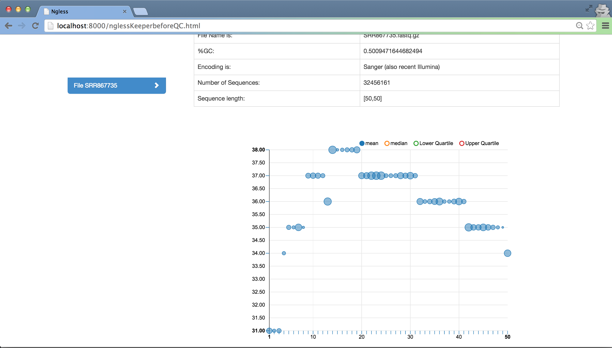

.. _Tutorial:

========
Tutorial
========

Example
-------

This example will use data from a real experiment stored at EMBL-EBI. The data
can be accessed at http://www.ebi.ac.uk/ena/data/view/SRP023199 and represent
**HeLa cells**. The idea is to preprocess the data set, map it against the
human genome and count the reads that overlap with known genes.

We will use the fastQ file
ftp://ftp.sra.ebi.ac.uk/vol1/fastq/SRR867/SRR867735/SRR867735.fastq.gz that can
be accessed in the table, on column **Sample accession**, with value
SAMN02179475.

Load fastQ file
~~~~~~~~~~~~~~~

Before creating the whole script lets start by understanding our data set. This
first step will allow you to perform quality control.

::

	ngless "0.0"

	/* load the data set */
	input = fastq('SRR867735.fastq.gz')

You can now save the script (as `test.ngl` for example) to the directory
where the file ``SRR867735.fastq.gz`` is and run ngless::

	$ ngless test.ngl

Using a web browser, you can open the file ``test.output_ngless/index.html`` to
see information about a data set and the ngless job. At 'Before QC' there will
be the result of the execution.

We can now see that the data set has:
	
- +/- 50% of guanine and cytosine.
- Follows the Encoding Sanger.
- Has 32456161 sequences
- And all sequences have the same length (50).

Also, by analyzing the plot we can see that the first 3 base pairs, on average,
have the lowest quality (31.0). So, a good preprocess starts by removing the
first 3 base pairs. 

Feel free to explore all the available statistics.

Preprocess
~~~~~~~~~~

For the preprocessing of the data we will:

- Remove the first **3** base pairs.
- Substrim with a minimum quality of **15**.
- Discard if the length of a read is **smaller than 20**.

Let's add the following code to the already existent code::
	
	preprocess(input) using |read|:
        read = read [3:] // Discard from position 0 until 3 (excluded).
        read = substrim(read, min_quality=15)
        if len(read) < 20:
         discard

The `using |var|` syntax is similar to Ruby's blocks or lambda functions in
other languages. The whole block after using is executed for each read in
`input`, each time assigning it to the variable `read`.

This will generate quality control that will be detailed at the execute
section.

Map
~~~

After adding the preprocess code, it's time to map against the human genome.
Since the human genome is provided by default, you can simply do:

::

	/* reference genome */
	human = 'hg19'
	mapped = map(input, reference=human)

Counting
~~~~~~~~

We are only interested in the human genes so lets annotate the mapping results
to the corresponding genes. Since we used a genome provided by NGLess, we do
not need to specify which annotation file to use (it'll be built in)::

	/* features to annotate */
	feats = ['gene']
	counts = count(mapped, multiple={dist1}, keep_ambiguous=false, features=feats)

You can also see the use of some symbol arguments (symbols are the special
strings inside braces, like `{dist1}`). Symbols are like strings, except that
when a function takes a symbol, that means that there is a set of predefined
values it can take. So, for example, the function `count` takes a `multiple`
argument which defines how to count reads which can be assigned to mulitple
features. The options are `{all1}` (count all equally as 1), `{1overN}`
(distribute equally across all candidates, i.e., increment them by 1/N), or
`{dist1}` (distribute multiple features by using the singly mapped features as
a baseline). In practice, the difference between strings and symbols is that
symbols are, as much as possible, checked at the start of interpretation (if
you write `{all2}`, you will immediately get a message "did you mean all1?"
before interpretation starts or if you run the script with -n, which just
performs this validation).

Write to disk
~~~~~~~~~~~~~

Finally, we write the results to a file::

	/* write counts to disk */
	write(counts, ofile="samples/CountsResult.txt")

Execute
-------

You can now save the script (as **test.ngl** for example) to the directory
where the file 'SRR867735.fastq.gz' is and run ngless.  ::

	$ ngless test.ngl

As a result of the execution, should be returned the following:

.. code-block:: bash

	Total reads: 31654060
	Total reads aligned: 28095945[88.76%]
	Total reads Unique map: 22434229[79.85%]
	Total reads Non-Unique map: 5661716[20.15%]
	Total reads without enough qual: 0

These are statistics of the map of the file against the human genome.

